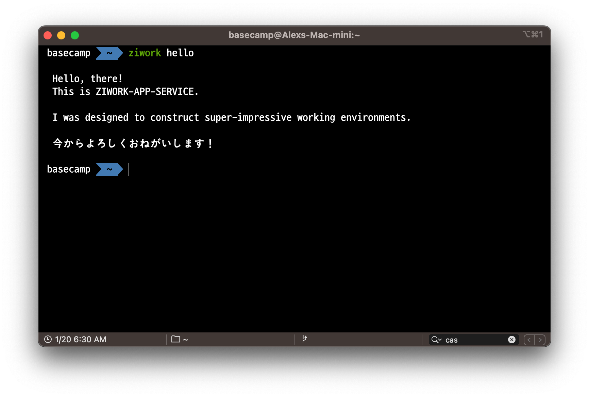

# ziwork-app-service



<p align="center">
  
  
  
  
  <br/>
  
  
  
  
  <br/>
  
  
</p>
<br/>

## Outline

This application is designed to assist my personal work experience and to make it more efficient.

<br/>

## Goal

- Displaying useful information
- Adding schedule on Google Calender
- Sending email on Gmail
- Logging diary on Database

<br/>

## How it works

### keywords

| keyword | description                        |
| ------- | ---------------------------------- |
| ziwork  | let terminal know statement starts |
| get     |                                    |
| post    |                                    |
| update  |                                    |
| delete  |                                    |
| commit  |                                    |

### tags

| tag | description |
| --- | ----------- |
| -d  | date        |
| -t  | tag         |
| -m  | message     |
| -a  | account     |

<br/>

## Examples

```
$ ziwork post schedule -d 230106 -t univ -m "개설과목공시"
```

```
$ ziwork post email -a austin.jiuk.kim@gmail.com
```

# Reference

| memo                     | link                                                       |
| ------------------------ | ---------------------------------------------------------- |
| Google Calendar API 개요 | https://developers.google.com/calendar/api/guides/overview |
| Gmail API Overview       | https://developers.google.com/gmail/api/guides             |
| openai Playground        | https://beta.openai.com/playground                         |
